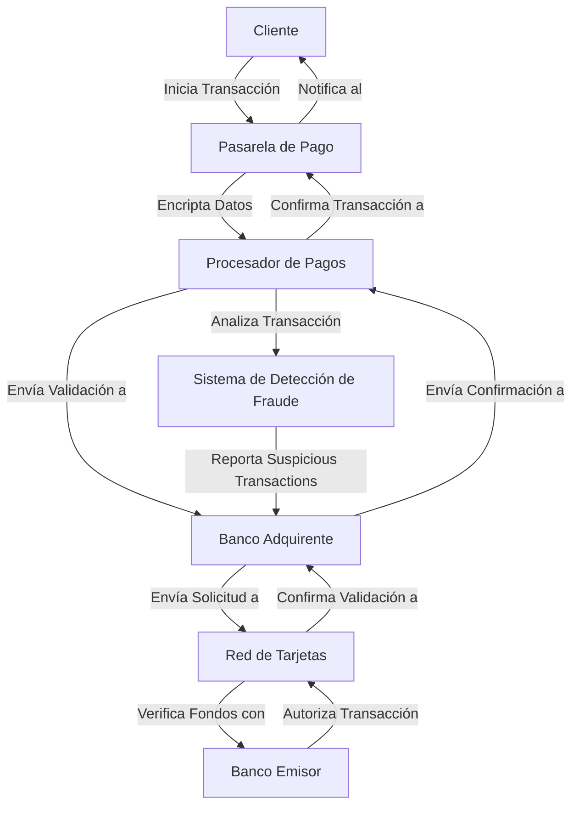
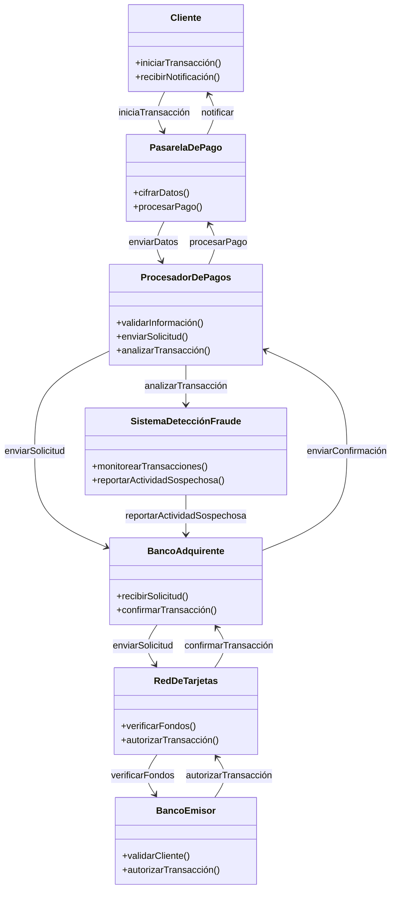

# Comprender el funcionamiento de una pasarela de pago

Una pasarela de pago es un servicio que facilita el procesamiento de transacciones entre un comerciante y un cliente en línea. Aquí tienes una explicación básica de su funcionamiento:

### 1. Iniciación de la transacción

El cliente selecciona productos en un sitio web y procede al pago, donde ingresa los datos de su tarjeta u otros métodos de pago (como PayPal).

### 2. Encriptación de datos

La pasarela de pago cifra estos datos para proteger la información sensible durante la transmisión.

### 3. Validación

La pasarela envía la información al procesador de pagos o al banco adquirente del comerciante, que a su vez la comunica a la red de la tarjeta de crédito (Visa, MasterCard, etc.).

### 4. Autorización

El banco emisor de la tarjeta verifica si el cliente tiene fondos suficientes y si la transacción es legítima. Si todo está en orden, autoriza el pago.

### 5. Detección de Fraude

Durante la autorización, se implementa un sistema de detección de fraude que analiza patrones de comportamiento, verifica datos y alerta sobre transacciones sospechosas.

### 6. Confirmación

La pasarela de pago notifica al comerciante y al cliente si la transacción fue aprobada o denegada.

### 7. Liquidación

Si fue aprobada, los fondos se transfieren del banco del cliente al comerciante, completando la transacción.

Este proceso ocurre en segundos y asegura una transacción segura y eficiente.

---

# Definición: Diagrama de Flujo

Un diagrama de flujo es una representación gráfica que muestra el flujo de un proceso, sistema o algoritmo mediante símbolos estandarizados como rectángulos, óvalos y flechas. Cada símbolo representa una acción, decisión o paso específico, conectados por líneas que indican la secuencia y dirección del flujo.

Los diagramas de flujo son útiles para visualizar y entender procesos complejos, facilitando la comunicación, la resolución de problemas y la toma de decisiones. Son ampliamente utilizados en programación, diseño de sistemas y negocios para describir cómo fluye la información o las operaciones.

# Diagrama de Arquitectura de Software en Mermaid

### Notas sobre el Diagrama de Transición de Estados

- **Iniciada**: Estado inicial cuando el cliente inicia la transacción.
- **Datos Recibidos**: Estado en el que se reciben y procesan los datos de pago.
- **En Proceso**: Estado en el que se cifran los datos y se envían para su validación.
- **Autorización**: Estado en el que se envía la solicitud de pago al banco adquirente.
- **Fondos Verificados**: Estado donde se comprueban los fondos disponibles.
- **Transacción Autorizada**: Estado final donde la transacción se autoriza y se confirma el pago.
- **Transacción Denegada**: Estado donde la transacción es rechazada, y se notifica al cliente.
- **Detección de Fraude**: Estado en el que el sistema analiza la transacción en busca de actividad sospechosa.
- **Finalizada**: Estado final del proceso, independientemente de si la transacción fue exitosa o no.

### 3. Estructura de Carpetas del Proyecto

A continuación se presenta una estructura de carpetas organizada para el proyecto de desarrollo de la pasarela de pago con un sistema de detección de fraude:

#### Descripción de la Estructura

- **/frontend**: Contiene el código y recursos del lado del cliente, estructurado en componentes, páginas, estilos, y utilidades, incluyendo componentes para la gestión de detección de fraude.
- **/backend**: Contiene el código del lado del servidor, organizando controladores, modelos, rutas, middleware y servicios de negocio, además de incluir servicios para la detección de fraude.
- **/integrations**: Almacena los servicios de integración con pasarelas de pago, sistemas de detección de fraude y otros servicios de terceros.
- **/tests**: Carpeta dedicada a las pruebas, organizando pruebas unitarias y de integración tanto para el frontend como para el backend, incluyendo pruebas específicas para el sistema de detección de fraude.
- **README.md**: Archivos de documentación para proporcionar información sobre cada parte del proyecto, incluyendo cómo se implementa y se utiliza el sistema de detección de fraude.

## Aquí hay una estructura simple de cómo podría verse un diagrama de Gantt para este proyecto:

| Tarea         | Mes 1 | Mes 2 | Mes 3 | Mes 4 | Mes 5 |
| ------------- | ----- | ----- | ----- | ----- | ----- |
| Planificación | ████  |       |       |       |       |
| Diseño        |       | ████  |       |       |       |
| Desarrollo    |       |       | █████ |       |       |
| Integración   |       |       |       | ████  |       |
| Pruebas       |       |       |       |       | ████  |
| Despliegue    |       |       |       |       | ████  |
| Mantenimiento |       |       |       |       | ████  |
